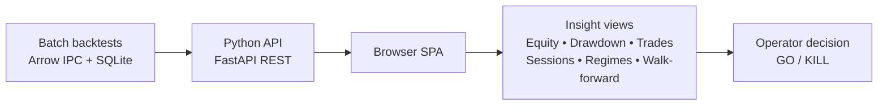

# Analytical Review and Evidence Expansion of the “External Dashboard & Visualisation Research” Brief

## Executive summary

The attached document is a plain-text research brief for “Epic 4, Story 4.2 — External Dashboard & Visualisation Research” (dated 2026-03-19) for a personal forex backtesting pipeline dashboard. fileciteturn0file0 The brief is unusually strong on *decision intent* (“go/no‑go in minutes”) and correctly frames the work as *decision support* rather than live monitoring, which materially changes UI priorities and performance expectations. fileciteturn0file0

Most “claims” in the brief are not empirical claims; they are *requirements* (FR62–FR68, NFR6) and *research questions* that external researchers must answer. fileciteturn0file0 Where the brief does venture into factual territory about third‑party products, primary documentation broadly corroborates the direction: **MetaTrader 5**’s Strategy Tester emphasises balance/equity curves and a “deposit load” histogram rather than richer regime/session/walk-forward analytics. citeturn1search8turn1search0 **TradingView**’s Strategy Tester documentation confirms a metrics-heavy “Performance Summary” and a detailed “List of Trades” view, with trade-level run-up/drawdown fields suitable for deeper diagnostics. citeturn1search5turn1search1 **NinjaTrader** documentation confirms first-class walk-forward optimisation and Monte Carlo analysis features. citeturn1search3turn11search2turn11search13 **QuantConnect** documents a browser results experience spanning equity curves, trades/logs, stats and report-style distributions/underwater drawdown. citeturn2search0turn2search5turn2search15

Two high-impact evidence-based expansions tighten the brief into a sharper research programme:

- **Insight-first interaction design** is well-grounded in the visual information-seeking literature: *“overview first, zoom and filter, then details on demand”* is a robust organising principle for an analytics dashboard. citeturn22view0turn23view0 Embedding this explicitly as an evaluation rubric will make platform/library comparisons more objective.

- **Backtest risk of overfitting is quantifiable** and should inform the “confidence score” requirement. Research on the **Probability of Backtest Overfitting (PBO)** and the **Deflated Sharpe Ratio (DSR)** provides primary-source foundations for turning “confidence” into a measurable, explainable construct rather than a subjective traffic-light badge. citeturn17view0turn17view1turn23view2turn23view3

A notable internal contradiction/ambiguity is the brief’s characterisation of **TradingView Lightweight Charts** as having “no bar charts” while simultaneously listing it as a candidate. The library’s own documentation states it supports Bar and Histogram series (among others). citeturn15search15turn15search0 This matters because it changes what must be “paired” with a second charting system versus what can remain in one.

Finally, the brief’s 3-second loading target is directionally consistent with widely cited UX timing guidance and modern web performance metrics, but it needs to be operationalised into *measurable budgets* (payload size, time-to-interactive/INP, LCP, etc.), not just a single headline number. citeturn0search4turn10search3turn10search14

## Document extraction and structure

The attachment is an English plain-text research brief that defines (a) the purpose and decision context, (b) functional and non-functional requirements, (c) an “insight question” with seven insight challenges, (d) four research areas (platform study, visual patterns, charting libraries, dashboard frameworks), and (e) expected deliverables and explicit non-goals. fileciteturn0file0

The core architecture constraints stated are: Python backend (FastAPI REST), browser SPA frontend, batch backtest outputs loaded from Arrow IPC files and SQLite, and no streaming/live feeds. fileciteturn0file0 The underlying technologies (Arrow IPC and SQLite) are consistent with high-throughput local analytics: Arrow IPC is designed around the Arrow in-memory format and can avoid translation/deserialisation overhead when memory-mapped; SQLite is a serverless, file-based transactional SQL engine. citeturn14search16turn14search1turn14search2 A key (implicit) consequence is that “load within 3 seconds” will primarily be driven by *front-end payload sizes and rendering strategy*, not by “live latency engineering”. citeturn10search3turn10search7turn0search4

## Key themes, questions, and implicit assumptions

The unifying theme is a *decision-support* dashboard: the operator’s job is to detect failure modes (overfitting, cost fragility, regime dependence, temporal decay) quickly and *reject* strategies confidently. fileciteturn0file0 This is compatible with established visual analytics guidance: analytics UIs should provide an overview, enable filtering/zooming, and allow drill-down to details on demand. citeturn22view0turn23view0

The brief’s seven “insight challenges” implicitly assume:

- **The operator is already domain-competent**, i.e., comfortable interpreting equity curves, drawdowns, rolling risk metrics, session effects, and cost models. This is implied by the focus on “MT5 Strategy Tester mental model” and advanced diagnostics like MAE/MFE scatter and walk-forward stability. fileciteturn0file0
- **The analytics workload is interactive but not real-time**: since data is batch-generated and file-backed, the highest-value optimisations are pre-aggregation/downsampling and fast client-side rendering rather than streaming transport. fileciteturn0file0
- **Large time-series plots are unavoidable**: the document cites 300k–400k minute bars per pair-year. That scale makes naive “send all points as JSON and render raw” risky for a 3-second budget. fileciteturn0file0
- **“Confidence” must be explainable**: the requirement calls for a “confidence score breakdown (RED/YELLOW/GREEN)”. A traffic-light alone will not meet the “should I trust it?” bar unless it decomposes into auditable statistical and robustness factors. fileciteturn0file0

Two core, explicit questions in the brief drive most downstream design decisions:

- “How do the best platforms help a trader understand their backtest results?” fileciteturn0file0  
- “What should the operator see to make better decisions, and what’s the best tool to render it?” fileciteturn0file0

These are not answered by raw rendering benchmarks alone; they require *information hierarchy, interaction patterns, and robustness analytics*.

## Verified claims, contradictions, and evidence gaps

### Claim-by-claim verification table

The table below distinguishes between (i) requirements (cannot be “verified” as true/false, but can be supported by rationale), (ii) factual statements about third-party tools/libraries (verifiable), and (iii) open questions.

| Brief statement (paraphrased) | Type | Evidence from primary/official sources | Evidence gaps / notes |
|---|---|---|---|
| Dashboard is decision-support, not a live trading monitor; batch data only | Requirement/context | Consistent with the brief’s architecture constraint; not an external factual claim. fileciteturn0file0 | Requires explicit performance architecture decisions (pre-compute vs on-demand) rather than low-latency streaming work. |
| Pages must load within 3 seconds (standard views) | Requirement | Classic UX timing guidance emphasises that multi-second delays break flow and trust; modern web guidance targets LCP ~2.5s for “good” loading experience. citeturn0search4turn10search3turn10search14 | “3 seconds” must be decomposed into measurable budgets (payload size, render time, caching). Without a measurement definition it is ambiguous. citeturn10search6turn10search7 |
| Backend is Python FastAPI serving REST endpoints; frontend is browser SPA | Architectural constraint | FastAPI describes itself as a high-performance Python web framework for building APIs, and as an ASGI framework. citeturn14search0turn14search17 | REST alone may be suboptimal for transferring large numeric arrays unless a binary encoding is used (see Arrow IPC to browser). citeturn28search0turn14search16 |
| Data comes from Arrow IPC files and SQLite | Architectural constraint | Arrow IPC is designed to avoid translation between on-disk and in-memory representation and can use memory-mapping; SQLite is serverless and file-based. citeturn14search16turn14search1turn14search2 | The brief does not specify how Arrow/SQLite are exposed to the SPA (JSON? Arrow IPC streaming? pre-aggregated parquet?). That omission directly impacts NFR6 feasibility. citeturn28search0turn28search4 |
| Equity curve scale: 300k–400k M1 points per year per pair | Data estimate | FX markets are commonly described as operating ~24 hours a day, 5 days a week, yielding ~374k minutes/year (consistent with the range). citeturn0search11 | Exact minute counts depend on trading calendar/holiday handling and data vendor conventions; the brief does not define them. I don’t know the intended convention from the brief alone. |
| MT5 Strategy Tester shows balance/equity curves and deposit load histogram | Factual claim | MetaTrader 5 documentation explicitly describes the Strategy Tester “Graph” tab as displaying balance (blue) and equity (green), with a deposit load histogram (margin/equity). citeturn1search8turn1search0 | The brief’s “MT5 blind spots” list is plausible, but “absence” claims must be treated carefully: MT5 can be extended/exported, but native UI docs do not describe session/regime/walk-forward visual panels. citeturn1search8turn1search0 |
| TradingView Strategy Tester provides performance metrics and a trade list with rich per-trade fields | Factual claim | TradingView’s documentation lists “Performance Summary” metrics and a “List of Trades” that includes timestamps, P/L, cumulative profit, run-up, and drawdown. citeturn1search5turn1search1 | The brief’s “best chart UX in retail” is subjective; I don’t know a primary-source way to verify that statement as written. |
| NinjaTrader has mature walk-forward tooling and Monte Carlo views | Factual claim | NinjaTrader documentation covers walk-forward optimisation and running Monte Carlo simulations from Strategy Analyzer reports. citeturn1search3turn11search2turn11search13 | “Most mature” is comparative; maturity requires a defined benchmark set. |
| QuantConnect provides browser-based backtest results dashboard and report plots | Factual claim | QuantConnect documents a backtest results page including equity curve, trades, logs, stats, and report charts such as returns distributions and drawdown (underwater) plots. citeturn2search0turn2search5turn2search15 | The brief should specify which QuantConnect views are “stealable” versus which depend on data not present (benchmarks, factor models, etc.). |
| Lightweight Charts is open source and performance-oriented | Factual claim | TradingView states Lightweight Charts is open-source under Apache 2.0 and “super compact”; release notes describe performance optimisation (data conflation) for large datasets. citeturn3search8turn15search7turn3search20 | The brief says it has “no bar charts”; library docs list Bar and Histogram series. This is a contradiction/overstatement that should be corrected to “not a general-purpose statistical charting suite”. citeturn15search15turn15search0 |
| ECharts can address large data via Canvas/progressive rendering | Factual claim | ECharts describes progressive rendering/stream loading and explicitly discusses Canvas vs SVG trade-offs, recommending Canvas for large numbers of elements. citeturn7search9turn6view0 | “10 million data in realtime” is an aspirational claim; your actual results depend on chart type, interactions, and hardware. I don’t know your achieved performance without benchmarking. citeturn7search9 |
| Plotly supports WebGL traces and Dash warns about SVG performance limits | Factual claim | Plotly documents WebGL-based trace types (e.g., scattergl) and Dash documentation notes SVG rendering can be slow for large datasets and recommends WebGL. citeturn7search2turn3search22 | Bundle size is a known concern; Plotly and Dash discuss partial/custom bundles to reduce loading overhead. citeturn16search8turn16search5 |
| Highcharts Stock provides navigator/range selector; licensing may constrain use | Factual claim / question | Highcharts documents navigator and range selector features; licensing pages distinguish standard commercial licence from separate non-commercial terms. citeturn15search8turn15search1turn3search7turn3search3 | The brief should explicitly classify the project’s use as personal/non-commercial vs commercial to avoid later rework. citeturn3search7 |
| Grafana can query REST and render dashboards via plugins | Factual claim | Grafana’s JSON API datasource plugin can visualise data from any URL returning JSON, but is in maintenance mode and recommends the Infinity datasource; it also does not keep query history. citeturn8search1turn8search21 | The plugin limitations make Grafana less suitable for interactive exploratory analytics unless the data model is adapted to Grafana’s strengths. citeturn8search21turn8search9 |
| AG Grid supports virtualised sortable/filterable tables; free vs enterprise trade-offs | Factual claim | AG Grid’s official comparison states Community is free for production use; Enterprise requires a licence. citeturn8search0 | Decide early which “enterprise-only” features are required to avoid lock-in surprises. citeturn8search0 |

### Data scale chart derived from the brief’s numeric ranges

The brief includes multiple numeric ranges (point counts, window counts, load target). The chart below visualises the *relative magnitude* of the stated data volumes (log scale) to make the key bottleneck obvious: time-series rendering dwarfs everything else. fileciteturn0file0

### Specific contradictions or underspecified areas

- **Lightweight Charts capability**: the brief positions it as lacking bar charts, yet the library’s own docs list Bar and Histogram among supported series. citeturn15search15turn15search0 The real limitation is that it is *time-series/financial-chart centric* rather than a full statistical chart suite (heatmaps, categorical bars, scatter matrices).

- **“Not a prototype build” vs “performance benchmarks”**: the deliverables require benchmarks at 300k+ points, which practically implies building at least a minimal harness/prototype per library (even if not a full dashboard). fileciteturn0file0 Unless you define “benchmark harness is allowed”, external researchers may produce incomparable anecdotal claims.

- **Undefined “standard views” and “3 seconds”**: without a view inventory and a metric definition (e.g., LCP at p75, INP threshold), NFR6 is not testable. citeturn10search3turn10search7turn0search4

## Evidence-based expansion of the insight and visual analytics requirements

### Turning “insight” into a testable interaction model

A robust way to operationalise the brief’s “INSIGHT” mandate is to treat the dashboard as a visual information-seeking system: provide *overview → interactive refinement → drill-down* pathways. This is directly aligned with entity["people","Ben Shneiderman","hci researcher"]’s visual information-seeking mantra. citeturn22view0turn23view0

Concretely, for the brief’s workflow (“decide in minutes”), this suggests:

- **Overview**: a “strategy card” summarising health (net/gross performance, max drawdown, time under water, key stability indicators) with immediate red flags.
- **Zoom/filter**: interactive segmentation by time (IS/OOS/forward), session, volatility regime, and cost model; plus brushing that synchronises all plots.
- **Details-on-demand**: full trade log with rich per-trade fields and the ability to click a trade to highlight it across equity curve, price chart, and drawdown anatomy.

This aligns with the brief’s goal of making differences “immediately obvious” while keeping deeper evidence accessible on demand. fileciteturn0file0

### Making “confidence score” defensible with primary research

The brief requires a “confidence score breakdown”. fileciteturn0file0 If left as heuristic, it risks becoming a single, un-auditable “gut feel” indicator. There is a strong primary-source foundation for a more rigorous approach:

- The **Deflated Sharpe Ratio (DSR)** addresses two key inflation sources: (1) multiple testing/selection bias (“winner’s curse”) and (2) non-normal returns. citeturn17view1turn23view3  
- The **Probability of Backtest Overfitting (PBO)** formalises how often an in-sample-optimal strategy underperforms out-of-sample and proposes a cross-validation framework (CSCV) for estimating it. citeturn17view0turn23view2

A research-grounded “confidence breakdown” could therefore be decomposed into explainable components such as:

- **Selection-bias adjusted performance** (DSR or similar) citeturn17view1  
- **Overfitting risk** (PBO/CSCV outputs) citeturn17view0  
- **Temporal stability** (rolling/segmented metrics; stability across walk-forward windows) citeturn1search3  
- **Cost robustness** (gross vs net equity divergence; sensitivity to plausible spreads/slippage) citeturn2search15turn1search8 (for drawdown/equity context in existing tools)

Even if you do not implement DSR/PBO immediately, using them as *research benchmarks* will materially improve the quality of “kill it” decisions relative to basic Sharpe/max drawdown alone. citeturn17view0turn17view1

### Visual diagnostics that directly match the brief’s insight challenges

The brief names specific diagnostic questions (regime dependence, session behaviour, drawdown anatomy, etc.). fileciteturn0file0 Below is a research-grounded mapping from those questions to *visual forms that are known to support analytic reasoning*, plus notes on implementation implications.

| Insight challenge from brief | High-value visual forms (and why) | Primary sources that support feasibility/rationale |
|---|---|---|
| Regime awareness | Overlay regime markers on equity curve; facet results by regime (small multiples); show rolling risk/return panels that reveal instability. | “Overview first… zoom/filter…” supports segmentation + drill-down workflow. citeturn22view0 |
| Session behaviour (Asian/London/NY overlap) | Heatmaps (hour × day-of-week P&L), session-sliced cumulative returns, and session-specific cost drag overlays. | Feasibility depends on chart library breadth (heatmap support; faceting). ECharts positions Canvas as suitable for large/complex charts. citeturn6view0turn7search9 |
| Temporal stability | IS/OOS/forward shading; walk-forward window small multiples; window pass/fail heatmap; rolling Sharpe/win rate. | Walk-forward concept is explicitly documented in NinjaTrader and implies window-by-window evaluation. citeturn1search3turn11search9 |
| Cost sensitivity | Dual equity curves (gross vs net) + “cost drag” area; sensitivity slider for spread/slippage scenarios with cached recomputation. | Existing platforms emphasise equity vs balance; QuantConnect documents drawdown/equity series availability. citeturn1search8turn2search2turn2search15 |
| Trade clustering | Calendar heatmap (daily P&L); trade timestamp scatter/strip plots; session-coloured P&L histograms. | Requires statistical chart types beyond basic financial time-series (ECharts/Plotly are better positioned than Lightweight Charts alone). citeturn7search9turn7search6 |
| Drawdown anatomy | Underwater plot + annotation of top drawdowns; recovery duration distribution; drawdown vs trade count scatter. | QuantConnect defines drawdown as peak-to-trough loss since prior max equity and explicitly provides an underwater drawdown chart in reports. citeturn2search15turn2search5 |
| Comparison | Synchronously aligned equity curves; per-metric sparklines; parameter sensitivity heatmaps; walk-forward stability panels. | Graphical perception research supports careful choice of encodings for accurate comparisons (position/length generally outperform angle/area for quantitative judgement). citeturn22view1turn23view1 |

### Downsampling is necessary, but must not distort analysis conclusions

Given the equity curve point counts cited, *visual* downsampling is not optional if you want fluid interaction under a 3-second load budget. fileciteturn0file0 Downsampling research aimed at *visual representation* explicitly warns that visual downsampling should be applied after other processing and may unpredictably affect other algorithms if misapplied. citeturn24view1turn25view0

This supports a clean separation:

- **Backtest computations** operate on full-resolution series.
- **Dashboard rendering** uses a downsampling pipeline (potentially multi-resolution) with explicit user cues (“displayed at 1:50 sampling; zoom for detail”).

This is compatible with the brief’s intent: the operator needs to see *shape, regimes, drawdown structure*, then zoom into exact trade-level evidence. citeturn22view0turn24view1

## Technology landscape validation for platforms, libraries, and frameworks

### What established platforms demonstrably show

Primary documentation supports the brief’s choice of “platform study” targets as *pattern libraries*:

- **MetaTrader 5** highlights balance/equity curves and deposit load, providing a baseline mental model but limited built-in segmentation. citeturn1search8turn1search0  
- **TradingView** provides a strong structured breakdown of performance metrics and a per-trade list with run-up/drawdown, making “trade anatomy” and distribution work more approachable. citeturn1search5turn1search1  
- **NinjaTrader** explicitly supports walk-forward optimisation and Monte Carlo simulation, matching the brief’s emphasis that most retail tools under-serve walk-forward visualisation. citeturn1search3turn11search2  
- **QuantConnect** shows what a quant-developer-oriented backtest UI includes: equity, trades, logs, and report-style distributions including underwater drawdown and returns distributions. citeturn2search0turn2search15turn2search5  

image_group{"layout":"carousel","aspect_ratio":"16:9","query":["MetaTrader 5 Strategy Tester Graph tab balance equity deposit load screenshot","TradingView Strategy Tester Performance Summary tab screenshot","NinjaTrader walk forward optimization Strategy Analyzer screenshot","QuantConnect backtest results page equity curve trades statistics screenshot"],"num_per_query":1}

### Charting libraries: evidence-based capability and risk summary

| Library | What primary sources confirm | Fit vs brief (3-second load, 300k+ points, mixed chart types) |
|---|---|---|
| TradingView Lightweight Charts | Open-source under Apache 2.0; positioned as compact; supports Line/Area/Baseline/Candlestick/Bar/Histogram series; recent releases add “data conflation” for performance on large datasets. citeturn3search8turn15search15turn3search20turn15search7 | Strong for financial time-series UX and small bundle, but not a full statistical viz system (heatmaps, categorical bars, complex facets). Likely needs pairing with another library for Research Area 2’s non-time-series visuals. citeturn15search15turn3search20 |
| Apache ECharts | Positions Canvas as suitable for large numbers of elements and describes progressive rendering/stream loading for very large datasets. citeturn6view0turn7search9 | Broad chart type coverage (including heatmaps/3D in practice) and a single “one-library” approach is plausible; actual 300k–400k interactive performance depends on configuration (sampling, progressive settings) and must be benchmarked. I don’t know your achieved performance without tests. citeturn7search9turn6view0 |
| Plotly.js | Provides WebGL trace types such as scattergl; Dash docs explicitly warn SVG slows with large datasets and recommend WebGL; partial/custom bundles exist to reduce load time. citeturn7search2turn3search22turn16search8turn16search5 | Excellent for multi-chart analytics (subplots, faceting), but bundle size and interaction smoothness at 300k–400k points are key risks; mitigations include WebGL + downsampling + partial bundling. citeturn3search22turn16search8 |
| D3.js / visx / d3fc family | D3 positions itself as bespoke visualisation with high flexibility; visx combines d3 concepts with React components; d3fc provides building blocks for custom charts using SVG and canvas. citeturn15search9turn9search2turn9search23 | Highest flexibility for bespoke “insight” visuals, but highest engineering cost. Most suitable when you have a very specific interaction model that higher-level libraries fight. |
| Highcharts Stock | Documents navigator and range selector features; supports ES module tree-shaking; licensing varies for non-commercial vs standard use. citeturn15search8turn15search1turn16search7turn3search7turn3search3 | Very strong built-in financial interaction primitives; licensing needs early clarification (personal vs commercial). citeturn3search7turn15search12 |
| uPlot | Positions itself as small/fast, canvas-based, claiming very fast creation of an interactive chart with ~166k points from cold start. citeturn7search3 | Likely excellent for high-density time-series. Feature surface is intentionally minimal; expect custom work for rich annotations and multi-chart dashboards. citeturn7search3 |

Two pragmatic conclusions follow from the primary-source evidence above:

1. A **single-library strategy** is most plausible with ECharts (breadth + scale features) but needs careful benchmarking and configuration. citeturn7search9turn6view0  
2. A **two-library strategy** is often the cleanest mapping to the brief’s requirements: use a financial-chart specialist (Lightweight Charts/uPlot/Highcharts Stock) for core time-series interaction, and a general library (ECharts/Plotly) for heatmaps, scatters, distributions, and faceting. citeturn15search15turn7search2turn7search9turn7search3  

### Dashboard framework options: what is validated, and what is risky

| Framework option in brief | What official docs confirm | Fit vs brief’s “insight UX” and long-term maintainability |
|---|---|---|
| Grafana | Can be extended with datasources; JSON API datasource can visualise arbitrary JSON URLs but is in maintenance mode (recommends Infinity) and requires each query to contain the complete dataset. citeturn8search1turn8search21turn8search9 | Strong for monitoring-style dashboards; the JSON plugin limitations and panel constraints may fight the bespoke, chart-led exploratory interactions the brief prioritises. citeturn8search21 |
| Streamlit | Has a defined client-server architecture; designed for quickly building data apps. citeturn8search6turn8search2 | Fast to iterate, but matching a highly polished, multi-panel, interaction-rich quant dashboard may be challenging without significant custom component work. |
| Panel (HoloViz) | Built on Bokeh infrastructure and server; designed for dashboards communicating between Python and browser. citeturn9search0turn9search4 | Strong for Python-native apps; long-term maintainability for a single developer can be good, but complex JS-first chart interactions may still require custom integration. |
| Dash (Plotly) | Callback model is core; docs discuss performance considerations and scaling approaches. citeturn9search1turn9search9 | Mature and capable; but callback complexity can grow quickly; high-density chart performance hinges on Plotly/WebGL + downsampling. citeturn3search22turn16search8 |
| Evidence | Describes itself as an open-source SQL + markdown framework for data products; queries embedded in markdown and executed by the framework. citeturn8search3turn8search19 | Attractive for report-style batch analytics; may be less suitable for highly interactive “brush-linked” chart systems unless extended significantly. |
| Custom React SPA | Not a vendor claim; it’s the “build” option. | Best match to bespoke insight UX and “steal this pattern” replication, with highest engineering cost and greater need for disciplined scope control. |

### Data transport and file-format leverage: Arrow can reach the browser directly

Because the brief already standardises on Arrow IPC for batch outputs, it is worth exploiting the fact that Arrow has a JavaScript implementation that can read Arrow IPC and load data via fetch. citeturn28search0turn28search4turn14search16 This creates a credible path to avoiding large JSON payloads:

- Serve Arrow IPC (stream or file) from the API.
- Parse in the browser using Arrow JS.
- Render with a chart library using typed arrays.

This aligns with Arrow’s design goal of reducing translation/serialisation overhead. citeturn14search16turn28search0turn28search11 I don’t know whether this approach is intended in the current pipeline, because the brief does not specify the wire format between API and SPA. fileciteturn0file0

## Recommended next steps, with a decision framework and evidence-backed acceptance criteria

### Recommended next steps table

| Next step | What it produces | Why it is recommended (evidence) | Acceptance check |
|---|---|---|---|
| Define “standard views” and a performance budget | A short list of view templates + measurable budgets (payload size, LCP/INP targets, render time budget) | “3 seconds” is not testable without an operational definition; modern guidance uses user-centric metrics (e.g., LCP ≤ 2.5s, INP thresholds). citeturn10search3turn10search7turn0search4 | You can measure p75 LCP/INP on a representative dataset and device profile. citeturn10search3turn10search17 |
| Create a benchmark harness (not a full dashboard) | One page per chart library with the same datasets and interactions (pan/zoom, markers, split shading, tooltip, brush) | The brief requires “performance benchmarks with 300k+ points”; comparable results require a controlled harness. fileciteturn0file0 | Reproducible test script + recorded metrics; failures are attributable to known interactions, not “overall feel”. |
| Specify the “confidence score” as a decomposition | A metric spec: components, formulas, and explanation UI | Primary research provides defensible building blocks (DSR for selection bias; PBO for overfitting probability). citeturn17view1turn17view0 | Each confidence component is explainable and linked to a supporting chart/table, not just a colour. |
| Decide on downsampling policy (visual only) | A documented rule: where downsampling happens, which algorithm, user-visible cues | Visual downsampling can aid rendering but must not alter analytical results; downsampling literature warns against applying it before other processing. citeturn24view1turn25view0 | Full-resolution metrics remain unchanged; downsampling is only applied at render layer with clear disclosure. |
| Select a “two-layer” visual stack if needed | Pairing decision (e.g., time-series specialist + general statistics library) | Primary docs show that no single financial chart library covers all statistical needs; pairing is often lowest risk. citeturn15search15turn7search9turn3search22turn7search3 | Each FR/insight view has an identified rendering tool with no “hand-wavy” gap. |
| Lock licensing assumptions early | A written statement: personal/non-commercial vs commercial; chosen licences | Highcharts explicitly separates standard licensing from non-commercial terms; misclassification can force rework. citeturn3search7turn3search3 | Legal/usage posture is unambiguous before implementation. |
| Produce the “steal this” pattern catalogue | Annotated screenshots + interaction notes per platform | Platform docs confirm where key insights live (MT5 graph/report; TradingView summary/trades; NinjaTrader WFO/Monte Carlo; QuantConnect report). citeturn1search8turn1search5turn11search2turn2search15 | Each adopted pattern is tied to a specific insight challenge and a UI rationale. citeturn22view0 |

### A concrete evaluation rubric for external research outputs

To ensure external research is comparable and “insight-first”, require each candidate platform/library/framework write-up to answer:

1. **Time-to-first-insight**: Can a competent user answer “deploy or kill?” within 60–180 seconds, and which above-the-fold elements enable that? (Grounded in overview→filter→details interaction model.) citeturn22view0  
2. **Overfitting resistance**: Does the UX make validation boundaries (IS/OOS/forward; walk-forward windows) impossible to ignore? (Grounded in walk-forward concepts and overfitting research.) citeturn1search3turn17view0  
3. **Cost realism**: Is gross vs net performance visually explicit, and can cost assumptions be stress-tested? (Grounded in the brief’s failure modes and in existing backtest report practices.) citeturn2search15turn1search8  
4. **Rendering at scale**: Can the tool deliver smooth interaction at the stated point counts using credible techniques (WebGL, progressive rendering, downsampling), without undermining correctness? citeturn3search22turn7search9turn24view1  
5. **Maintainability for one operator/developer**: Does the choice reduce long-term complexity (licensing, ecosystem health, API stability, integration friction)?

### Source posture and limits

Where possible, verification above uses primary vendor documentation and original research papers. Some potentially relevant sources (notably certain journal articles and the original Steinarsson downsampling thesis) were not accessible without paywalls or returned access errors; in those cases, the report relies on accessible open PDFs and official documentation, and states uncertainty where that limits confidence. citeturn24view1turn17view0turn17view1turn10search3